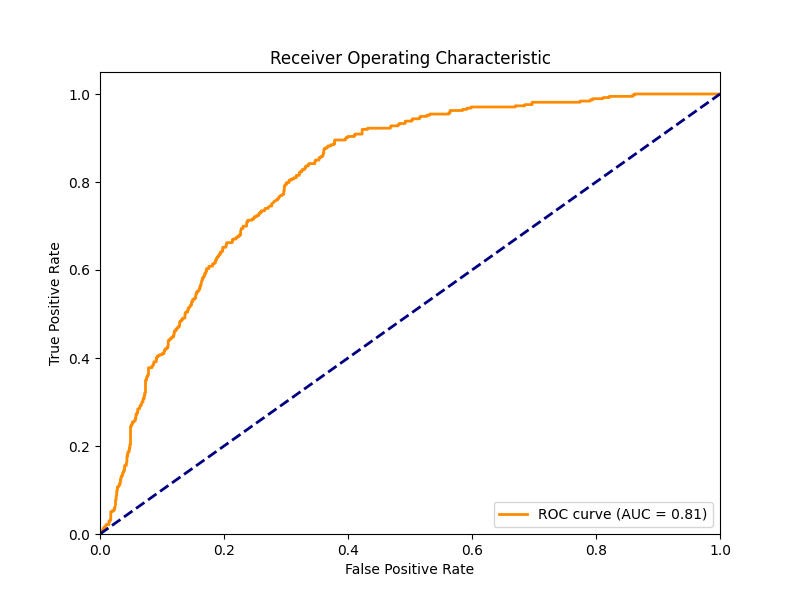
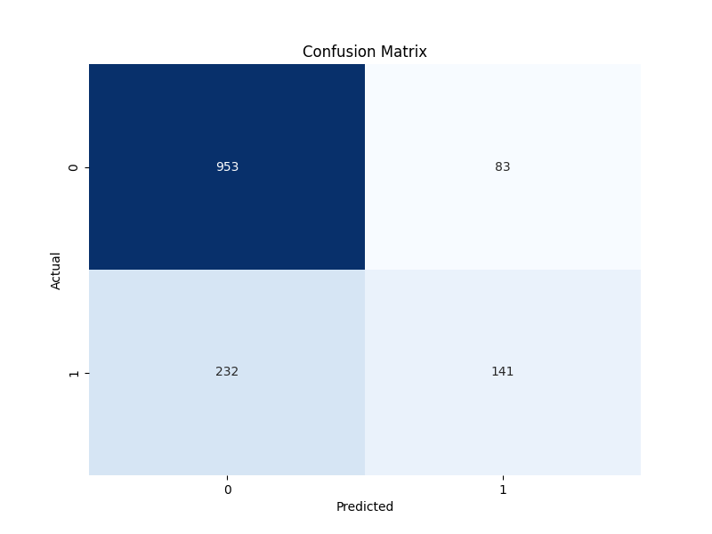

# Customer Churn Prediction

This project aims to predict customer churn (i.e., whether a customer will discontinue their subscription) based on various features in the Telco Customer Churn dataset.

## Methodology

### Data Preprocessing

- **Data Cleaning**: The dataset was checked for missing values, and any missing data was handled appropriately.
- **Feature Encoding**: Categorical features were encoded using label encoding.
- **Feature Scaling**: Standard scaling was applied to normalize the feature values.
- **Train-Test Split**: The data was split into training and testing sets with a 80-20 ratio.

### Model Selection

- **Logistic Regression**: A logistic regression model was chosen as the primary classification algorithm.
- **Hyperparameter Tuning**: A randomized search with cross-validation was used to find the best hyperparameters for the logistic regression model.

### Model Evaluation

- **Accuracy**: The model's performance was evaluated using accuracy as the primary metric.
- **Receiver Operating Characteristic (ROC) Curve**: The ROC curve was plotted to visualize the model's true positive rate and false positive rate.
- **Confusion Matrix**: A confusion matrix was generated to assess the model's performance in terms of true positives, true negatives, false positives, and false negatives.

## Results

The logistic regression model achieved an accuracy of approximately 81.16 % on the test set, indicating its ability to predict customer churn.

## Visualizations

- **ROC Curve**:

- **Confusion Matrix**:

